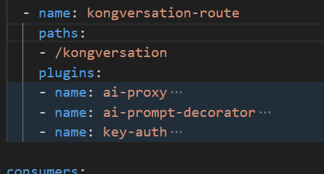
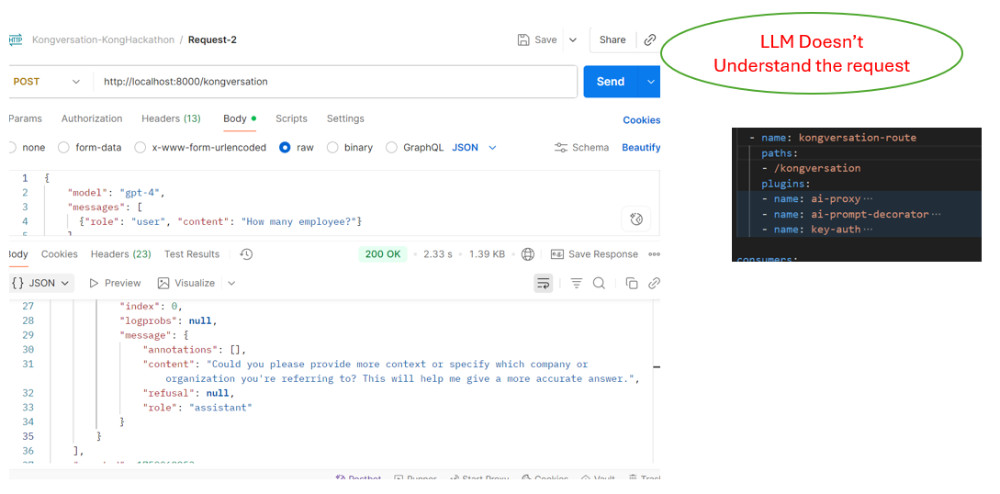
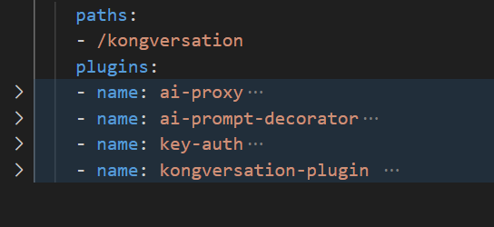
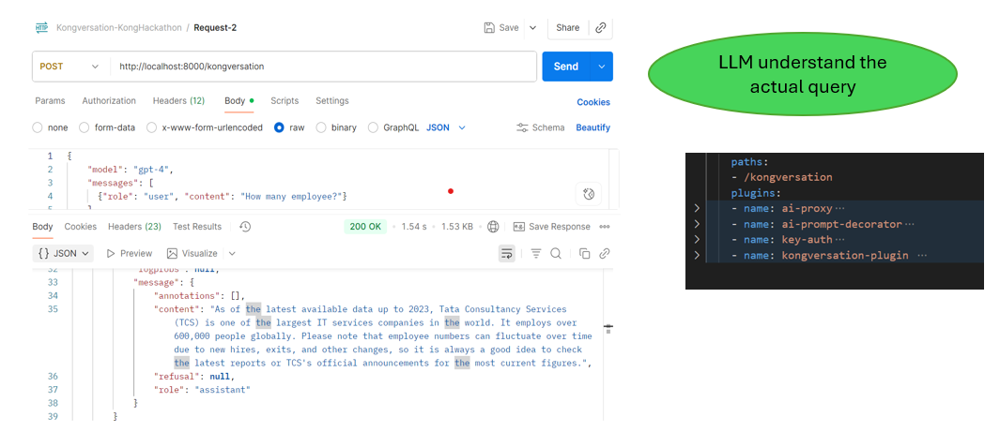

# Stateless LLMs with Smart Contextual Memory using Kong Gateway  
  
## Overview  
  
Large Language Models (LLMs) are stateless by design — they don’t remember past interactions unless you send the full conversation every time. This creates overhead for developers and clients.  
  
This project demonstrates how to use Kong Gateway with kongversation-plugin to provide a conversation memory layer.  
• Stores chat history per consumer-key or short lived oauth token in Kong, not the LLM.  
• Automatically appends message history before sending to the LLM.  
• Keeps the LLM backend stateless and scalable.  
• Provides a seamless “chat-like” experience for consuming applications.  
  
  <p align="center" width="100%">
    
</p>
  
## Industry Use Cases   
This pattern is useful across industries where chat-based or context-aware interactions are needed:  
• Customer Support 🛠️ – Context-aware bots that remember past questions.  
• Banking & Finance 💳 – Secure, per-customer conversational AI (history tied to consumer-key or token).  
• Healthcare 🏥 – Patient chatbots that recall recent medical interactions while keeping backend stateless.  
• E-commerce 🛒 – Personalized shopping assistants that remember preferences.  
• Enterprise Apps 🏢 – AI copilots that assist employees across multiple requests without duplicating input.  
  
## Installing the plugin
There are two things necessary to make a custom plugin work in Kong:
1. Install it locally (based on the .rockspec in the current directory): 
```
 sudo luarocks make
```
2. Pack the installed rock: 
```
luarocks pack YOUR-PLUGIN-NAME PLUGIN-VERSION
```
3. Load the plugin files.
The easiest way to install the plugin is using `luarocks`.
```
luarocks install https://github.com/manisaurabh24/kongversation-plugin/blob/main/kongversation-plugin/kongversation-plugin-1.0-1.all.rock
```

You can substitute `0.1.0-1` in the command above with any other version you want to install.


5. Specify that you want to use the plugin by modifying the plugins property in the Kong configuration.

Add the custom plugin’s name to the list of plugins in your Kong configuration:

```conf
plugins = bundled, kongversation-plugin
```

If you are using the Kong helm chart, create a configMap with the plugin files and add it to your `values.yaml` file:

```yaml
# values.yaml
plugins:
  configMaps:
  - name: kongversation-plugin
    pluginName: kongversation-plugin
```
  
## Configuring Kong Gateway - Without KongVersation Plugin 

1\. Enable Required Plugins  
  
This project uses:  
• key-auth → authenticate clients using consumer-key or oauth token in header.  
• ai-prompt-decorator → decorate the responses from LLM  
• ai-proxy → forward the request to the LLM (Azure , OpenAI, Anthropic, or other providers).  

<p align="center" width="100%">
    
</p>

  
  
2\. Example Declarative Config (kong.yaml)  
change the config based on your llm and target server. Eg:
```
_format_version: "3.0"
_info:
  select_tags:
  - kongversation
_konnect:
  control_plane_name: tcsai
services:
- name: kongversation-service
  url: https://httpbin.konghq.com
  routes:
  - name: kongversation-route
    paths:
    - /kongversation
    plugins:
    - name: ai-proxy
      instance_name: "ai-proxy-kongversation"
      enabled: true
      config:
        balancer:
          algorithm: round-robin
          connect_timeout: 60000
          failover_criteria:
            - error
            - timeout
          hash_on_header: X-Kong-LLM-Request-ID
          latency_strategy: tpot
          read_timeout: 60000
          retries: 5
          slots: 10000
          tokens_count_strategy: total-tokens
          write_timeout: 60000
        embeddings: null
        genai_category: text/generation
        llm_format: openai
        max_request_body_size: 8192
        model_name_header: true
        response_streaming: allow
        targets:
          - auth:
              allow_override: false
              aws_secret_access_key: null
              azure_client_id: null
              azure_client_secret: null
              azure_tenant_id: null
              azure_use_managed_identity: false
              header_name: api-key
              header_value: '{vault://azure-openai/apikey}'
              param_location: null
              param_name: null
              param_value: null
            description: null
            logging:
              log_payloads: false
              log_statistics: true
            model:
              name: null
              options:
                anthropic_version: null
                azure_api_version: <<replace>>
                azure_deployment_id: <<replace>>
                azure_instance: <<replace>>
              provider: azure
            route_type: llm/v1/chat
            weight: 100
        vectordb: null
      enabled: true
      id: 710bc3cc-cca7-472d-ab55-3b1fb1b1dd31
      name: ai-proxy-advanced
      protocols:
        - grpc
        - grpcs
        - http
        - https
    - name: ai-prompt-decorator
      instance_name: ai-prompt-decorator-kongversation
      enabled: true
      config:
        prompts:
          prepend:
          - role: system
            content: "You will always respond in the English (India) language."
    - name: key-auth
      instance_name: key-auth-kongversation
      enabled: true
   
consumers:
  - username: kongversation-app-a                              
    keyauth_credentials:
      - key: kongversation-app-a-123                      
  - username: kongversation-app-b                          
    keyauth_credentials:
      - key: kongversation-app-b-123               
 
  
  
```

  
▶️ Testing the Setup  - - Without KongVersation Plugin 
  
Request 1  
```
curl --location 'http://localhost:8000/kongversation' \
--header 'Content-Type: application/json' \
--header 'apikey: kongversation-app-a-123' \
--data '{
    "model": "gpt-4",
    "messages": [
      {"role": "user", "content": "Tell me about TCS?"}
    ]
  }'
```
👉 Sent to LLM:  
```
{ "messages": \["Tell me about TCS"\] }  
```
 
⸻  
  
Request 2  
```
curl --location 'http://localhost:8000/kongversation' \
--header 'Content-Type: application/json' \
--header 'apikey: kongversation-app-a-123' \
--data '{
    "model": "gpt-4",
    "messages": [
      {"role": "user", "content": "How many employees ?"}
    ]
  }' 
```
👉 Sent to LLM: 
```
{ "messages": \["How many employees?"\] }  
  
```
👉 Summary:
LLM doesn't understand the query.
<p align="center" width="100%">
    
</p>

## Configuring Kong Gateway -  KongVersation Plugin 

1\. Enable Required Plugins  
  
This project uses:  
• key-auth → authenticate clients using consumer-key or oauth token in header.  
• ai-prompt-decorator → decorate the responses from LLM  
• ai-proxy → forward the request to the LLM (Azure , OpenAI, Anthropic, or other providers).  
• kongversation-plugin → custom Kong plugin that adds memory to LLM API calls. It caches conversation history per API key, merges new messages, and forwards enriched context to upstream models. Developers can skip or clear history via headers, enabling stateless clients while Kong maintains stateful, multi-tenant chat continuity.. 

<p align="center" width="100%">
    
</p>

  
  
2\. Example Declarative Config (kong.yaml)  
change the config based on your llm and target server. Eg:
```
_format_version: "3.0"
_info:
  select_tags:
  - kongversation
_konnect:
  control_plane_name: tcsai
services:
- name: kongversation-service
  url: https://httpbin.konghq.com
  routes:
  - name: kongversation-route
    paths:
    - /kongversation
    plugins:
    - name: ai-proxy
      instance_name: "ai-proxy-kongversation"
      enabled: true
      config:
        balancer:
          algorithm: round-robin
          connect_timeout: 60000
          failover_criteria:
            - error
            - timeout
          hash_on_header: X-Kong-LLM-Request-ID
          latency_strategy: tpot
          read_timeout: 60000
          retries: 5
          slots: 10000
          tokens_count_strategy: total-tokens
          write_timeout: 60000
        embeddings: null
        genai_category: text/generation
        llm_format: openai
        max_request_body_size: 8192
        model_name_header: true
        response_streaming: allow
        targets:
          - auth:
              allow_override: false
              aws_secret_access_key: null
              azure_client_id: null
              azure_client_secret: null
              azure_tenant_id: null
              azure_use_managed_identity: false
              header_name: api-key
              header_value: '{vault://azure-openai/apikey}'
              param_location: null
              param_name: null
              param_value: null
            description: null
            logging:
              log_payloads: false
              log_statistics: true
            model:
              name: null
              options:
                anthropic_version: null
                azure_api_version: <<update_azure_api_version>>
                azure_deployment_id: <<update_azure_deployment_id>>
                azure_instance: <<update_azure_instance>>
              provider: azure
            route_type: llm/v1/chat
            weight: 100
        vectordb: null
      enabled: true
      id: 710bc3cc-cca7-472d-ab55-3b1fb1b1dd31
      name: ai-proxy-advanced
      protocols:
        - grpc
        - grpcs
        - http
        - https
    - name: ai-prompt-decorator
      instance_name: ai-prompt-decorator-kongversation
      enabled: true
      config:
        prompts:
          prepend:
          - role: system
            content: "You will always respond in the English (India) language."
    - name: key-auth
      instance_name: key-auth-kongversation
      enabled: true
    - name: kongversation-plugin 
      instance_name: kongversation-plugin 
      config:
          key_namespace: cacheandadd
          cache_ttl: 3600
          request_array_field: messages
          apikey_header: apikey
          max_items: 1000
          deduplicate: true
          forward_mode: full
          log_level: info
    

consumers:
  - username: kongversation-app-a                              
    keyauth_credentials:
      - key: kongversation-app-a-123                      
  - username: kongversation-app-b                          
    keyauth_credentials:
      - key: kongversation-app-b-123               
 
               
 
  
  
```

  
▶️ Testing the Setup  - -  KongVersation Plugin 
  
Request 1  
```
curl --location 'http://localhost:8000/kongversation' \
--header 'Content-Type: application/json' \
--header 'apikey: kongversation-app-a-123' \
--data '{
    "model": "gpt-4",
    "messages": [
      {"role": "user", "content": "Tell me about TCS?"}
    ]
  }'
```
👉 Sent to LLM:  
```
{ "messages": \["Tell me about TCS"\] }  
```
 
⸻  
  
Request 2  
```
curl --location 'http://localhost:8000/kongversation' \
--header 'Content-Type: application/json' \
--header 'apikey: kongversation-app-a-123' \
--data '{
    "model": "gpt-4",
    "messages": [
      {"role": "user", "content": "How many employees ?"}
    ]
  }' 
```
👉 Sent to LLM: 
```
{ "messages": \["Tell me about TCS", "How many employees?"\] }  
  
```
Summary:
LLM  understand the query non.
<p align="center" width="100%">
    
</p>

⸻  

Resetting History  
  
If you want to clear the conversation for a client (new chat), you can:  
• Set a lower ttl in ai-contextualizer, or  
• Extend the plugin logic to check for a custom header like x-clear-history: true and clear cached history.  
Sample Curl
```
curl --location 'http://localhost:8000/kongversation' \
--header 'Content-Type: application/json' \
--header 'apikey: kongversation-app-a-123' \
--header 'x-clear-history: true' \
--data '{
    "model": "gpt-4",
    "messages": [
      {"role": "user", "content": "How many Employee?"}
    ]
  }'
  
```

Skip History
If you want to skip the conversation for a client (new chat), you can:  
• Set a lower ttl in ai-contextualizer, or  
• Extend the plugin logic to check for a custom header like x-skip-history: true and clear cached history.  
Sample Curl
```
curl --location 'http://localhost:8000/kongversation' \
--header 'Content-Type: application/json' \
--header 'apikey: kongversation-app-a-123' \
--header 'x-skip-history: true' \
--data '{
    "model": "gpt-4",
    "messages": [
      {"role": "user", "content": "How many Employee?"}
    ]
  }'
  
```


  
⸻  
  
🚀 Benefits  
• Keeps LLM stateless → scalable and provider-agnostic.  
• Adds smart memory at the API layer.  
• Provides per-client isolation using apikey.  
• Reduces developer effort → no need to manage conversation state in apps.  
  
⸻  
  
🚀 Future Roadmap  
• Integrate with the extennal caching for production ready use cases.
⸻    
